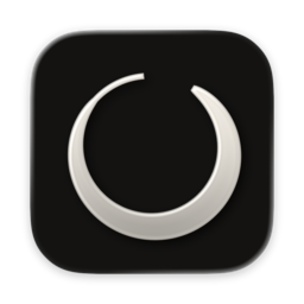
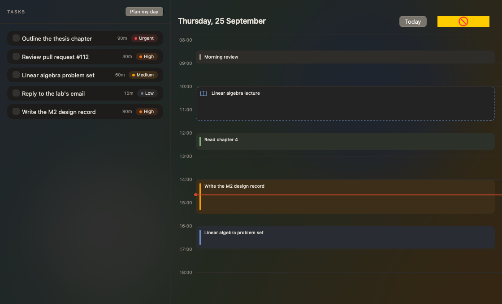
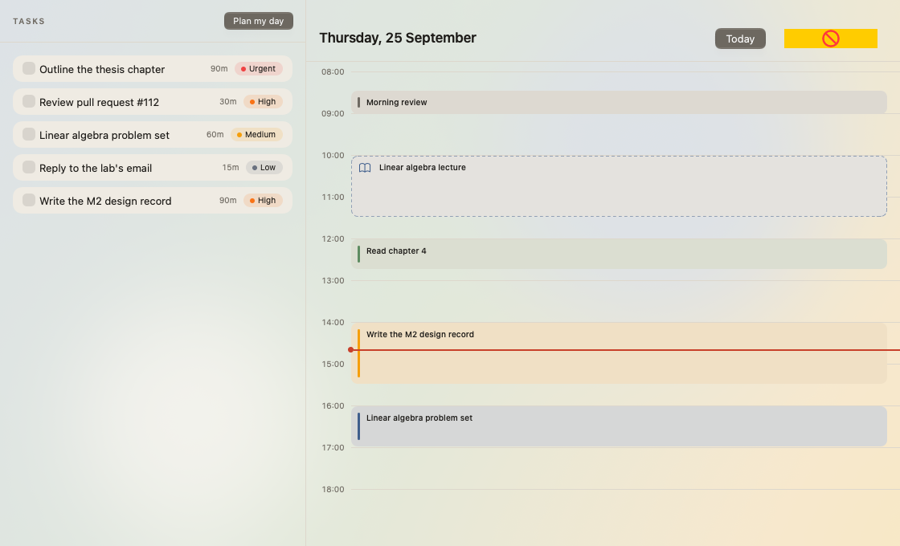
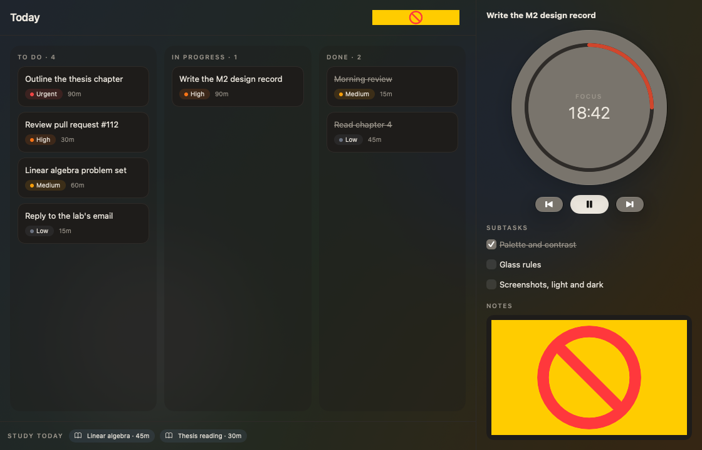
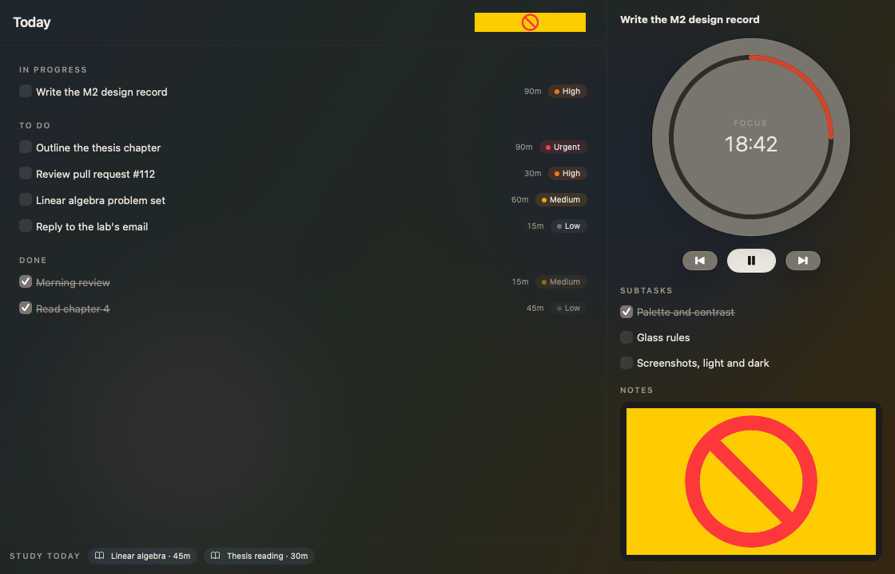
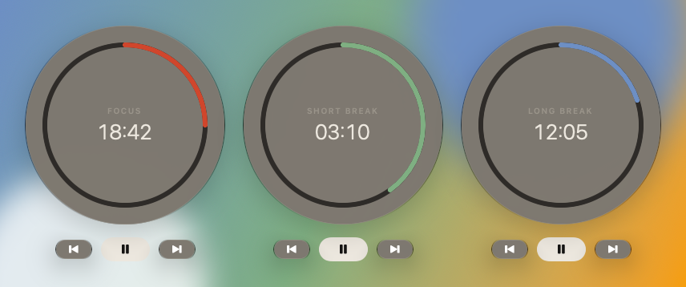
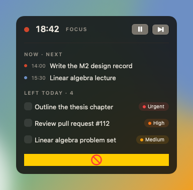
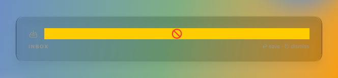
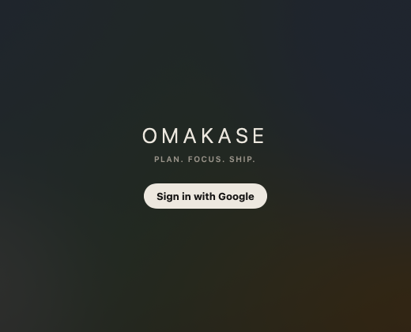

# Omakase design system: Apple

The visual identity of the macOS app (and, later, iOS), decided in M2
(#99-#104) and settled with the user at the mockup checkpoint (#101).
`docs/design-system.md` remains the record of the web client this follows.

**The values live in code, not here.** The tokens are in
`apps/apple/Packages/OmakaseFeatures/Sources/OmakaseFeatures/Design/`, and
the tests in `Tests/OmakaseFeaturesTests/` pin every rule that can be
measured. This page gives the reasons. If this page and the code disagree,
the code is right and this page is stale.

## Principles

1. **Close to the web client.** Its navigation, its screens, and its
   monochrome restraint. The Mac app is the web client made native, not a
   redesign.
2. **Dark first.** Dark is the default appearance (`Appearance.default`,
   IDEA.md) and every token is declared dark first. Light is supported and
   tested, but it is the alternative.
3. **Monochrome chrome.** Buttons, selection and system controls are ink and
   grey. Colour is kept for meaning.
4. **Shu is a signal, never decoration.** It marks focus and "now", nothing
   else. The user rejected it on buttons.
5. **Translucent ground, solid things.** The window lets the desktop through;
   what you act on (cards, rows, blocks) is opaque.

## Palette

Sumi (warm ink and paper neutrals), a grey accent, and one signal colour.
Ratios are WCAG 2.x contrast, measured from the token values.

| Token | Dark | Light | Role | Measured |
|---|---|---|---|---|
| `background` | `#141312` sumi | `#F7F4EE` paper | the window's ground, laid at 80% over the blurred desktop | - |
| `surface` | `#1E1C1A` | `#EFEBE3` | cards, rows, calendar blocks (opaque) | - |
| `ink` | `#EDE8DF` | `#1C1A17` | text | 15.2 / 15.8 on background, 13.9 / 14.6 on surface |
| `inkMuted` | `#9A948A` | `#6F6A62` | secondary text, section labels | 6.17 / 4.89 on background, 5.64 / 4.51 on surface |
| `hairline` | `#2E2B28` | `#DDD7CC` | separators | decorative |
| `accent` | `#77726A` | `#6F6A62` | checkboxes, selection, `AccentColor` | white on it 4.77 / 5.37; 3.89 / 4.89 on background |
| `shu` | `#D0462C` | `#C8402A` | focus phase, the now line | 4.06 / 4.53 on background |
| `matcha` | `#7FAF82` | `#5E8C61` | short break | 7.38 / 3.54 on background |
| `indigo` (ai) | `#6D8FC4` | `#3F5E8C` | long break | 5.63 / 5.99 on background |

Priority dots keep the web's colours in both appearances: low `#6B7280`,
medium `#F59E0B`, high `#F97316`, urgent `#EF4444`.

**What the tests pin** (`PaletteTests`, `TranslucencyTests`,
`ButtonStyleTests`, `TintsTests`):

- Text (`ink`, `inkMuted`) is ≥ 4.5:1 on `background` and `surface`, in
  both appearances.
- Accents used as marks (shu, matcha, indigo) are ≥ 3:1 on `background`
  (WCAG 1.4.11).
- `accent` carries white at ≥ 4.5:1, stands out at ≥ 3:1 from the ground
  and cards, and has no more chroma than the neutrals. A pure grey would look
  blue next to warm sumi.
- The primary pill's label is ≥ 4.5:1 on the pill.
- Over the worst desktop (white behind dark, black behind light) with no
  blur credited, `ink` stays ≥ 4.5:1 (8.2 / 9.9) and `inkMuted` ≥ 3:1
  (3.32 / 3.06).
  - **The trade-off:** muted text drops below 4.5:1 only in this unblurred
    worst case. The real material keeps it well above.
  - A tint over 90% would close the gap and remove the translucency the user
    asked for.

Dark shu is `#D0462C`, not the first proposal `#E4583C`. That value gave a
white label only 3.65:1, and was the negative control when the tests were
written (#112).

## Type

SF Pro, the system font, through `TypeScale`'s named styles over text
styles, so Dynamic Type scales them. No font is bundled.

| Style | Base | Use |
|---|---|---|
| `display` | large title, light, tracking 6 | the `OMAKASE` wordmark, the timer's digits |
| `title` | title 2, semibold | screen and block titles |
| `headline`, `body`, `caption` | system | as named |
| `sectionLabel` | caption, semibold, uppercase, tracking 1.5, `inkMuted` | `Text("To do").sectionLabel()`, the web's signature label |

Digits that change (the timer, hours, estimates) use `.monospacedDigit()`.

## Space and shape

- **Spacing**, a 4-pt grid: `tiny 4, small 8, medium 12, large 16,
  xLarge 24, xxLarge 32`.
- **Radius:** `small 8` (marks, calendar blocks), `medium 12` (rows,
  cards), `large 16` (panels, columns).
- **Window:** at least `WindowSize.minimum`, 520 × 420.

No `Color(red:…)`, hex literal or bare `.padding(<number>)` appears outside
`Design/` in production code. The M2 smoke checks this with a grep.

## Surfaces and glass

| Surface | Treatment |
|---|---|
| Window ground | `omakaseWindowBackground()`: the system's blurred material under `background` at `Translucency.window` (80%) |
| Cards, rows, calendar blocks | opaque `surface`, so neither the desktop nor the hour lines show through |
| Chrome (sidebar, toolbar) | the system's own Liquid Glass, untinted |
| Floating surfaces (timer, capture) | `glassEffect` inside a `GlassEffectContainer`; the timer is tinted 18% toward its phase, capture is neutral |
| Menu-bar panel | the same translucent ground as the window |

This replaces the spec's first rule, "content stays opaque"
(`docs/superpowers/specs/2026-09-25-macos-client-design.md`, The app on
macOS). The user asked for transparency on the background. The opacity is
measured, not guessed: `TranslucencyTests`.

## Controls

- **One primary action per screen** (Sign in, the timer's pause/start):
  `.buttonStyle(.primary)`, an inverted ink pill. In dark mode it is light,
  with a sumi label.
- **Every other button:** `.buttonStyle(.glass)`, neutral.
- **System controls** (checkboxes, selection): `Palette.accent` through
  `.tint` and the app's `AccentColor`. They are grey, never the system blue.
- `.glassProminent` is not used. Its label colour is the system's choice
  (white), which fails on a light pill.

## Signals

- **The timer:**
  - a ring in the phase colour: focus shu, short break matcha, long break
    indigo (`TimerPhase.tint`)
  - a disc of glass tinted 18% toward that colour
- **Now:** a shu dot and line across the calendar.
- **Priority:** the web's pill (`PriorityBadgeView`), a tinted capsule with
  a coloured dot and the name in ink, beside the estimate. The name stays
  in ink because amber text on paper is too faint to read.
- **Calendar blocks:** the block's source colour (project or discipline) as
  a 3-pt bar and a faint fill on an opaque `surface`.
  - Class occurrences are dashed, because they are fixed, not planned.
  - Colour here is data, which is why it survives the monochrome rule.

## Layouts

The web client's navigation: **Plan, Focus, Review, Projects, Study** in
the sidebar, the account and Settings at its foot. A sidebar item exists
only once its screen does (`SidebarItem`). After M2 that is Focus, which
holds M1's Today list.

The screenshots below are offscreen layout renders (`MockupGallery`). Glass,
blur and native controls (segmented pickers, text editors) are drawn by the
system, so they appear only in the running app and in Xcode's preview
canvas. The yellow boxes are those controls' placeholders.

**Plan** is the day's tasks with "Plan my day", beside a day/week calendar
for time blocking (M4 builds it).

**Focus** is the day as a Kanban board or a list, with today's study blocks
under it, and the selected task on the right (built in M3.2,
`OmakaseFeatures/Focus/`).
- **The board:** carried-over tasks sit in To do, marked "from Mon 2". In
  the list they have their own section.
- **Marks:** a deadline shows as "Due Fri 13", or "Overdue", only when it
  differs from the plan day.
- **Order:** columns sort by priority, then title, with no manual reorder.
  Dragging between columns works offline.
- **The panel:** Complete (the ink pill), Reschedule, and the subtasks.
- **The timer:** its disc and session notes join the panel in M3.3.

**The timer** in its three phases, with the menu-bar panel and the ⌥⌘N
capture panel.

**Sign-in:** the tracked wordmark, the tagline, and the one primary action.

## The icon

An ensō: one ink brush circle on sumi, open where the brush lifts.
- **Monochrome,** like the chrome.
- **The ensō echoes the timer's ring.**
- **Built as** an Icon Composer bundle
  (`apps/apple/OmakaseMac/AppIcon.icon`) whose layer renders as glass on
  macOS 26.
- **Generated, not hand-drawn:** the path in `Assets/enso.svg` is a stroke
  that swells and tapers.

## What changed from the web record, on purpose

| Web (`docs/design-system.md`) | Apple | Why |
|---|---|---|
| Outfit | SF Pro with a named scale | Dynamic Type, no bundled font, native feel |
| Monochrome timer | phase-tinted ring | the state reads at a glance, in the window and the menu bar (IDEA.md) |
| Opaque dark surfaces | translucent ground, opaque cards | the user asked for transparency on the background |
| Neutral greys | warm sumi greys | the identity, and a grey accent that doesn't read blue |

## The platform floor

The app targets **macOS 26**. Everything this identity uses shipped in 26:
- `glassEffect`, `GlassEffectContainer`
- `.glass` buttons
- `containerBackground(for: .window)`
- Icon Composer icons

macOS 27 (2026-09-14) adds nothing this design needs. Moving would mean
changing `project.yml`, three `Package.swift` files, the Xcode pin and CI's
runner. That was decided in #131.
